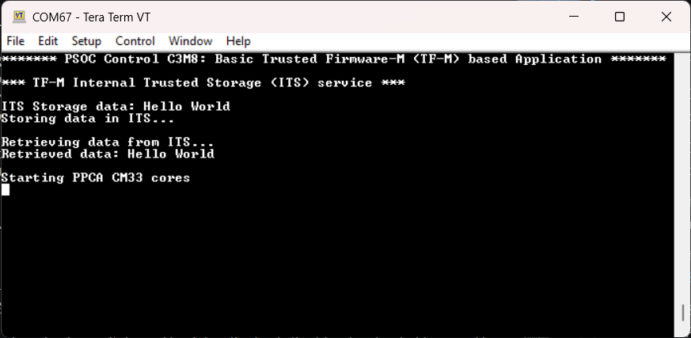

# PSOC&trade; Control C3M/P8 MCU: Basic TF-M Application

This is a basic code example for getting started with TrustedFirmware-M (TF-M) on Infineon's PSOC&trade; Control C3M/P8 MCU. The example demonstrates how to initialize the TF-M NS interface in CM33 NS project and use the services offered by TF-M with PSA APIs. The code example is designed to work with Edge Protect bootloader.

The README walks through how to add, configure, and build the Edge Protect bootloader for TF-M application. This document provides end‑to‑end flow: preparing a signed image, programming it, and verifying the signature before handing off to TF-M.

See the [Design and implementation](docs/design_and_implementation.md) for the functional description of this example.

[View this README on GitHub.](https://github.com/Infineon/mtb-example-ce243005-tfm-application)

[Provide feedback on this code example.](https://yourvoice.infineon.com/jfe/form/SV_1NTns53sK2yiljn?Q_EED=eyJVbmlxdWUgRG9jIElkIjoiQ0UyNDMwMDUiLCJTcGVjIE51bWJlciI6IjAwMi00MzAwNSIsIkRvYyBUaXRsZSI6IlBTT0MmdHJhZGU7IENvbnRyb2wgQzNNL1A4IE1DVTogQmFzaWMgVEYtTSBBcHBsaWNhdGlvbiIsInJpZCI6InRlamFzLmthZGdhb25rYXJAaW5maW5lb24uY29tIiwiRG9jIHZlcnNpb24iOiIxLjAuMCIsIkRvYyBMYW5ndWFnZSI6IkVuZ2xpc2giLCJEb2MgRGl2aXNpb24iOiJNQ0QiLCJEb2MgQlUiOiJJQ1ciLCJEb2MgRmFtaWx5IjoiUFNPQyJ9)


## Requirements

- [ModusToolbox&trade;](https://www.infineon.com/modustoolbox) v3.9.0 or later (tested with v3.9.0)
- Board support package (BSP) minimum required version for:
   - KIT_PSC3M8_EVK: v2.2.0
- Programming language: C
- Associated parts: All [PSOC&trade; Control C3M/P8 MCU](https://www.infineon.com/products/microcontroller/32-bit-psoc-arm-cortex/32-bit-psoc-control-arm-cortex-m33-mcu/psoc-control-c3-performance-line) parts


## Supported toolchains (make variable 'TOOLCHAIN')

- GNU Arm&reg; Embedded Compiler v14.2.1 (`GCC_ARM`) – Default value of `TOOLCHAIN`
- IAR C/C++ Compiler v9.70.4 (`IAR`)
- Arm&reg; Compiler v6.22 (`ARM`)


## Supported kits (make variable 'TARGET')

- [PSOC&trade; Control C3M8 Evaluation Kit](https://www.infineon.com/KIT_PSC3M8_EVK) (`KIT_PSC3M8_EVK`) – Default value of `TARGET`


## Hardware setup

This example uses the board's default configuration. See the kit user guide to ensure that the board is configured correctly.


## Software setup

See the [ModusToolbox&trade; tools package installation guide](https://www.infineon.com/ModusToolboxInstallguide) for information about installing and configuring the tools package.

<details><summary><b>ModusToolbox&trade; Edge Protect Security Suite</b></summary>

1. Download and install the [Infineon Developer Center Launcher](https://www.infineon.com/cms/en/design-support/tools/utilities/infineon-developer-center-idc-launcher)

2. Login using your Infineon credentials

3. Download and install the “ModusToolbox&trade; Edge Protect Security Suite” from Developer Center Launcher

    > **Note:** The default installation directory of the Edge Protect Security Suite in Windows operating system is *C:/Users/`<USER>`/Infineon/Tools*

4. After installing the Edge Protect Security Suite, add the Edge Protect tools executable to the system PATH variable

   Edge Protect tools executable is located in *<Edge-Protect-Security-Suite-install-path>/ModusToolbox-Edge-Protect-Security-Suite-`<version>`/tools/edgeprotecttools/bin*

</details>

Install a terminal emulator if you do not have one. Instructions in this document use [Tera Term](https://teratermproject.github.io/index-en.html).

Install Python if not installed already (requires Python 3.9 or later) – download from [Python.org](https://www.python.org/downloads/).


## Operation

See [Using the code example](docs/using_the_code_example.md) for instructions on creating a project, opening it in various supported IDEs, and performing tasks, such as building, programming, and debugging the application within the respective IDEs.

> **Note:** Windows has a 260 character path length limit, so for the TF-M application to build successfully, ensure that <WorkspacePath>\<Application Name> path (including back slash) is less than or equal to 32 characters.

1. Connect the board to your PC using the provided USB cable through the KitProg3 USB connector

2. Open a terminal program and select the KitProg3 COM port. Set the serial port parameters to 8N1 and 115200 baud


### Install TF-M dependencies

Install the required Python dependencies for TF-M. Run the following command from the application root, replacing `x.y.z` with the `ifx-tf-m` release version present in your workspace *mtb_shared* folder:

  ```
  pip install -r ./../mtb_shared/ifx-tf-m/release-vx.y.z/tools/requirements.txt
  ```


### Generate and Import Image Signing Key

If you already have signing keys generated, skip directly to the [Import key](#import-key) subsection.

   > **Note:** A sample key pair for ECDSA521 signature schemes in provided in the *keys/* folder for development/testing purposes only. Generate your own key pair for production use.


#### Prerequisite for Key Generation

Infineon’s Edge Protect Tools is a set of command line tools used to perform the functions needed for key signing, key generation, OEM certificate creation, device provisioning, and so on. These tools are executed through a shell tool. **Edge Protect Tools** executable is made available in the **Edge Protect Security Suite**, located in the *<Edge-Protect-Security-Suite-install-path>/ModusToolbox-Edge-Protect-Security-Suite-`<version>`/tools/edgeprotecttools/bin* directory.

Add the executable path to the system environment path variable of the host PC.

To use Edge Protect Tools CLI, is recommended to use "modus-shell", installed along with ModusToolbox&trade; located in the *ModusToolbox/tools_x.y* directory. 

#### Generate Key

Choose one signing scheme and Run the corresponding command to generate the key pair:

   - ECDSA521
      ```
      edgeprotecttools create-key --key-type ECDSA-P521 -o keys/oem_private_key_0.pem keys/oem_public_key_0.pem
      ```

The command produces two files:
   - oem_private_key_0.pem (private key; used to sign images)
   - oem_public_key_0.pem (public key; used to verify signatures)

   > **Note:** Keep the private key secure.


#### Import key

1. Open *\<Workspace>/\<CodeExampleName>/common.mk*

2. Set **IMAGE_SIGNING_KEY** variable to the path of your private key file (oem_img_sign_key_priv.der) and save the file.

   ```
   IMAGE_SIGNING_KEY = /path/to/oem_private_key_0.pem
   ```


### EdgeProtect Bootloader Setup

1. Add the [Edge Protect Bootloader](https://github.com/Infineon/mtb-example-ce43416-edgeprotect-bootloader) project to your workspace by following the steps in [Using the code example](docs/using_the_code_example.md). When the guide asks you to choose a code example, select the *PSOC Control C3P8 MCU Edge Protect Bootloader* (or, if using the CLI, specify the repository *mtb-example-ce43416-edgeprotect-bootloader*). After the project is created, open it in your preferred supported IDE as described

2. Configure the memory map

   1. Open *\<Workspace>/\<PSOC_Control_C3P8_MCU_EdgeProtect_Bootloader>/common.mk*

   2. Set **MEMORY_MAP** variable to the path of the memory map JSON file *overwrite_multi4_flash.json* made available with this code example in *memory_map* folder and save the file

      ```
      MEMORY_MAP = <Workspace>/<CodeExampleName>/memory_map/overwrite_multi4_flash.json.
      ```

3. Configure EdgeProtect Bootloader features

   1. Open *\<Workspace>/\<PSOC_Control_C3P8_MCU_EdgeProtect_Bootloader>/platforms/PSC3_P8/feature_config.json*

   2. Set the image validation scheme

      - `security_setup` > `validation_key_type` > `value` to `ECDSA-521`

   3. Set the image validation public key (use the public key that pairs with the private key used to sign the application images)

      - `security_setup` > `validation_key` > `value` to `/path/to/oem_public_key_0.pem`

   4. Enable image validation during boot

      - `security_setup` > `validate_boot` > `value` to `true`

   5. Enable image validation during update

      - `security_setup` > `validate_upgrade` > `value` to `true`

   6. Save and close the file

   ```
   "security_setup": {
   "validation_key_type": {
      "description": "Type of the image validation key. Possible values: 'ECDSA-256', 'ECDSA-384', 'ECDSA-521' 'LMS_SHA256_M32_H10', 'XMSS_SHA2_10_256'",
      "value": "ECDSA-521"
   },
   "validation_key": {
      "description": "Path to the image validation key. Example key path: ../keys/ecdsa-p256-pub.pem",
      "value": "/path/to/oem_public_key_0.pem"
   },
   "validate_boot": {
      "description": "Image validation during boot",
      "value": true
   },
   "validate_upgrade": {
      "description": "Image validation during upgrade",
      "value": true
   },

   ```

### Build, Program, and Verify

1. Build and Program the EdgeProtect Bootloader and TF_M application images to the device. After Programming, the application should start automatically. Confirm "PSOC Control C3M8: Basic Trusted Firmware-M (TF-M) based Application" is displayed on the UART terminal

    **Figure 1. Terminal output on program startup**

    

2. Confirm that PPCA cores are started by checking whether user LED 2 (D9) (by PPCA0) and user LED 6 (D13) (by PPCA1) are blinking. Confirm that MainCore has successfully called stored and retrieved data using TF-M's Internal storage Service (ITS) and is blinking User LED 1 (D8)


## Related resources

Resources  | Links
-----------|----------------------------------
Code examples  | [Using ModusToolbox&trade;](https://github.com/Infineon/Code-Examples-for-ModusToolbox-Software) on GitHub
Device documentation | [PSOC&trade; Control C3M/P8 MCU documents](https://www.infineon.com/products/microcontroller/32-bit-psoc-arm-cortex/32-bit-psoc-control-arm-cortex-m33-mcu/psoc-control-c3-performance-line?ftab=01#Documents)
Development kits | Select your kits from the [Evaluation board finder](https://www.infineon.com/cms/en/design-support/finder-selection-tools/product-finder/evaluation-board)
Libraries on GitHub  | [mtb-dsl-psc3m8](https://github.com/Infineon/mtb-dsl-psc3m8) – Device Support Library (DSL) <br> [retarget-io](https://github.com/Infineon/retarget-io) – Utility library to retarget STDIO messages to a UART port
Tools  | [ModusToolbox&trade;](https://www.infineon.com/modustoolbox) – ModusToolbox&trade; software is a collection of easy-to-use libraries and tools enabling rapid development with Infineon MCUs for applications ranging from wireless and cloud-connected systems, edge AI/ML, embedded sense and control, to wired USB connectivity using PSOC&trade; Industrial/IoT MCUs, AIROC&trade; Wi-Fi and Bluetooth&reg; connectivity devices, XMC&trade; Industrial MCUs, and EZ-USB&trade;/EZ-PD&trade; wired connectivity controllers. ModusToolbox&trade; incorporates a comprehensive set of BSPs, HAL, libraries, configuration tools, and provides support for industry-standard IDEs to fast-track your embedded application development.

<br>


## Other resources

Infineon provides a wealth of data at [www.infineon.com](https://www.infineon.com) to help you select the right device, and quickly and effectively integrate it into your design.


## Document history

Document title: *CE243005* – *PSOC&trade; Control C3M/P8 MCU: Basic TF-M Application*

 Version | Description of change
 ------- | ---------------------
 1.0.0   | New code example

<br>


All referenced product or service names and trademarks are the property of their respective owners.

The Bluetooth&reg; word mark and logos are registered trademarks owned by Bluetooth SIG, Inc., and any use of such marks by Infineon is under license.

PSOC&trade;, formerly known as PSoC&trade;, is a trademark of Infineon Technologies. Any references to PSoC&trade; in this document or others shall be deemed to refer to PSOC&trade;.

---------------------------------------------------------

(c) 2026, Infineon Technologies AG, or an affiliate of Infineon Technologies AG. All rights reserved.
This software, associated documentation and materials ("Software") is owned by Infineon Technologies AG or one of its affiliates ("Infineon") and is protected by and subject to worldwide patent protection, worldwide copyright laws, and international treaty provisions. Therefore, you may use this Software only as provided in the license agreement accompanying the software package from which you obtained this Software. If no license agreement applies, then any use, reproduction, modification, translation, or compilation of this Software is prohibited without the express written permission of Infineon.
<br>
Disclaimer: UNLESS OTHERWISE EXPRESSLY AGREED WITH INFINEON, THIS SOFTWARE IS PROVIDED AS-IS, WITH NO WARRANTY OF ANY KIND, EXPRESS OR IMPLIED, INCLUDING, BUT NOT LIMITED TO, ALL WARRANTIES OF NON-INFRINGEMENT OF THIRD-PARTY RIGHTS AND IMPLIED WARRANTIES SUCH AS WARRANTIES OF FITNESS FOR A SPECIFIC USE/PURPOSE OR MERCHANTABILITY. Infineon reserves the right to make changes to the Software without notice. You are responsible for properly designing, programming, and testing the functionality and safety of your intended application of the Software, as well as complying with any legal requirements related to its use. Infineon does not guarantee that the Software will be free from intrusion, data theft or loss, or other breaches (“Security Breaches”), and Infineon shall have no liability arising out of any Security Breaches. Unless otherwise explicitly approved by Infineon, the Software may not be used in any application where a failure of the Product or any consequences of the use thereof can reasonably be expected to result in personal injury.
