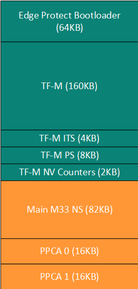

[Click here](../README.md) to view the README.

## Design and implementation

This code example uses a four-project structure to develop code for the main CM33, PPCA0, and PPCA1 cores. The four-projects are:
 
 **Table 1. Application projects**

Project        | Description
-------        | -----------------------
*main_cm33_s*  | Project for main CM33 SPE. TF-M is available as source code in the mtb_shared directory. main_cm33_s is completely built out of this TF-M library. Only Makefile and dependencies are present in this project directory that makes use of TF-M library. The TF-M application is executed from the internal Flash
*main_cm33_ns* | Project for main CM33 SPE. The NSPE project contains the TF-M interface and calls the PSA APIs to use TF-M services. The CM33 NS application is also executed from the internal Flash
*ppca_cm33_0*  | Project for PPCA CM330 non-secure processing environment (NSPE). This project does not contain TF-M interface. It is copied by main_cm33_ns from internal FLash to PPCA code SRAM for execution.
*ppca_cm33_1*  | Project for PPCA CM331 NSPE. This project does not contain TF-M interface. It is copied by main_cm33_ns from internal FLash to PPCA code SRAM for execution.

This code example needs **EdgeProtect Bootloader** project. The EdgeProtect Bootloader (EPB) is a secure bootloader designed for Infineon's PSOC&trade; Control MCU, enabling trusted firmware updates and secure application launches.

 

This code example demonstrates how to use TrustedFirmware-M (TF-M) with Infineon's PSOC&trade; Control C3M8 MCU. TF-M implements the SPE for Armv8-M and Armv8.1-M architectures (e.g., the Cortex&reg;-M33, Cortex&reg;-M23, Cortex&reg;-M55, and Cortex&reg;-M85 processors) and dual core platforms. It is platform security architecture reference implementation aligning with PSA-certified guidelines, enabling chips, real-time operating systems, and devices to become PSA-certified. For more details, see the [TrustedFirmware-M documentation](https://tf-m-user-guide.trustedfirmware.org/).

The ROMboot launches the Edge Protect Bootloader (EPB). The EPB authenticates the main CM33 secure (TF-M), main CM33 non-secure, PPCA 0 and PPCA 1 projects, and launches the CM33 secure application. The CM33 secure project contains TF-M, which creates an isolated space between the main M33 secure and M33 non-secure, PPCA0/1 images. TF-M is available in source code format as a library (ifx-tf-m) in the *mtb_shared* directory. The CM33 secure application does not have any source files and instead includes the TF-M library from *mtb-shared* for building TF-M firmware.

During the boot sequence, the TF-M's secure partition manager (SPM) creates the SPE and NSPE using TrustZone, MPU, MPC, and PPC protection units. TF-M offers several services that can be used by the non-secure application. These services are placed in independent partitions. The following partitions are initialized by the SPM:

- Internal trusted storage (ITS) 
- Protected storage (PS)
- Crypto
- Initial attestation
- Platform

After initializing the partitions, TF-M launches the main M33 NSPE project, which initializes TF-M interface and launches PPCA images. The main CM33 NS project calls TF-M via the PSA APIs. This code example uses the ITS service demonstration. After successful boot up, the PPCA projects blink LEDs.

For more information on the TF-M library and services, see the **Getting started with Trusted Firmware-M (TF-M) on PSOC&trade; Control** application note.

### Resources and settings

The application uses UART to print messages on the UART terminal. The UART resource initialization is performed by TF-M platform partition. The platform partition also exposes an API for non-secure world to log status using the same UART.

**Table 2. Application resources**

Resource    |  Alias/object      |    Purpose
:---------- | :------------------| :------------
 UART (HAL) | IFX_TFM_SPM_UART   | UART for TF-M logs
 GPIO (PDL) | CYBSP_USER_LED4    | User LED 4 from PPCA Core 0
 GPIO (PDL) | CYBSP_USER_LED6    | User LED 6 from PPCA Core 1
 GPIO (PDL) | CYBSP_USER_LED1    | User LED 1 from main core

### Flash Layout

The PSOC&trade; Control C3M/P8 MCU provides 512 KB of internal flash.

   - One slot for the Edge Protect Bootloader (EPB), starting at `0x32000000` with size `0x10000` (64KB).
   - Four primary application image slots, each paired with a secondary slot for staging updates.
   - Ensure that the combined size of all primary and secondary slots, metadata, and the EPB fits within 512 KB.

   **Figure 1. Flash mapping**

   
